#  Basketball Salary Prediction Regreassion Model

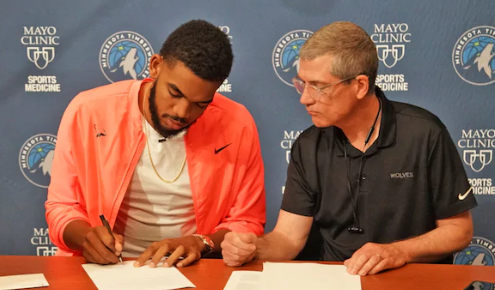

### (Karl-Anthony Towns, aka KAT, is pictured above)

# Introduction

The goal of my project is to design a model which can predict with high accuracy how much a porfessional basketball player in the NBA should be getting paid. 

The end goal of this type of project would be to better uinderstand who is beign overpaid or underpaid in the NBA and what a player should expect to get paid based on what they have proved so far. Ideally, this model would be great for an executive to understand how much he should pay is players or for players to understand how much leverage they have (or don't have) in a negotiation. This is primarily based on indivdual performance and that will be expanded upon later. One limitation of this model is that the NBA salary cap is ever-changning, and heavily influenced by many outside factors. Interestingly, since my data comes from 2017 and I am of the opinion that the salary cap will likely not increase so much soon (or may even decrease!), I believe my data and conclusions will still be relevant and applicable.

# Data

My data comes from kaggle.com, which is a public data repository with many free data sets. Most of my variables (after merging and sorting data) contain data on season statistics such as Total Points (divide by games for points per game like I did), advanced stats such as True Shooting Percent, and player data such as College or BMI. Here is a full list (feel free to research ones you don't know... also keep in mind that I added custom stats later - this is where I begun):

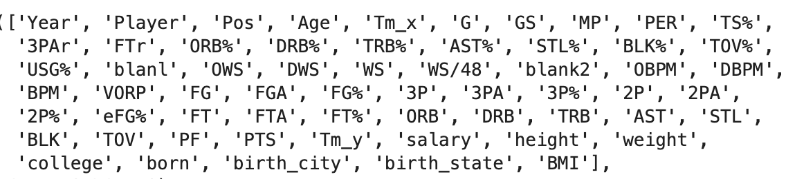

... and the distributions

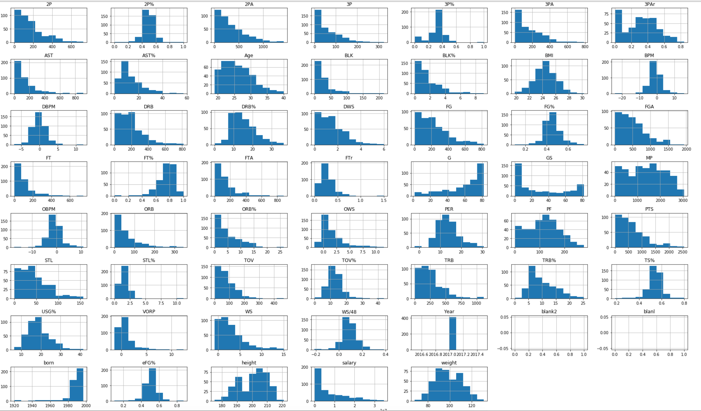

# Limitations and Other Notes

All of these stats are designed to predict NBA player salary. The data contains one point for each player that played in the 2016-17 season (even if they played one game and recorded no stats). I would now like to address an important point: the limitations of my data. First of all, they don't capture qualitative data; is a player a jerk? is a player a good leader? does the player have playoff experience? Next, it does not capture team effects. Did this player play on a good team or stand out on a bad team? Also the data does not capture the effect of potential or regression (like regressign to the mean). Sometimes a player who is not great shows potential and gets a big contract (which he will or will not prove right later on). Other times a player will either proof himself as a winner or demonstrate high potential and then decline. These contracts are a snapshot, not a full history. In addition, similar to the last point, my data does not address injury concerns. A player might get paid a lot and then get injured and have a bad contract in terms of his team. A player may be really good but get paid little because of injury concerns (like DeMarcus Cousins). It also does not capture the effect of desparation; from a player or a team. Say you have a player that is not good, but somehow lucks into a great contract he doesn't deserve or alternatively meets a team so desperate to sign one good player that they overpay a player. (Scottie Pippen was wildly underpaid and is a great example of the limitations of a study like this). Despite all these limitations and constraints, I believe that most players on average are not, in fact outliers, and therefore balance out the outliers to some degree. One more limitation is salary cap effects. Say a max contract is 25M in a year and then 50M two years later. You could have a top 5 player making around half of what a less elite player makes through no fault of his own. I'm sure there are other limitations I have not addressed. I actually was skeptical of my project at the beginnning due to all these concerns. We'll see later on if I was proven right or wrong on those concerns.

# EDA & Hypothesis Testing

My data cleaning process was relatively straightforward and included basic processes such as feature generation, categorical feature encoding, and removal off correlation. In addition to these steps, I also performed some hypothesis testing and exploratory data analysis (EDA) to get a feel for my data

## Hypothesis Testing

I'll quickly run through some hypotheses I tested and the results on a high level. The first thing I learned was (with high confidence) that shorter players tend to shoot better from 3-point range than taller players. I was not able to find a significant difference in the 2-point shooting percentages of point guards and shooting guards. Center, are on the other hand, tend to shoot better than power forwards. In terms of minutes played, I had trouble finding a big difference between the two guard positions. The biggest minutes-played disparity was between small forwards and centers but the difference was not different enough to generate high statistical significance.

## EDA

Below are a series of charts and graphs which will be accompanied by explanations when necessary.

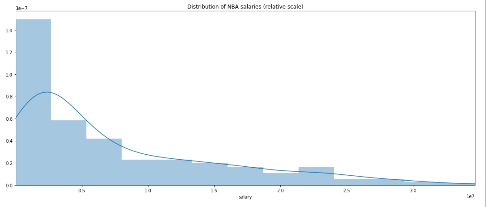

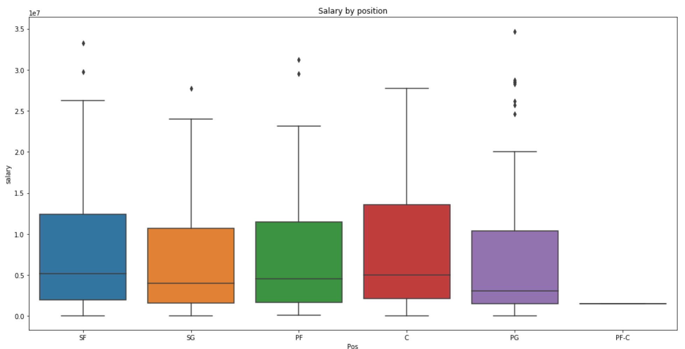

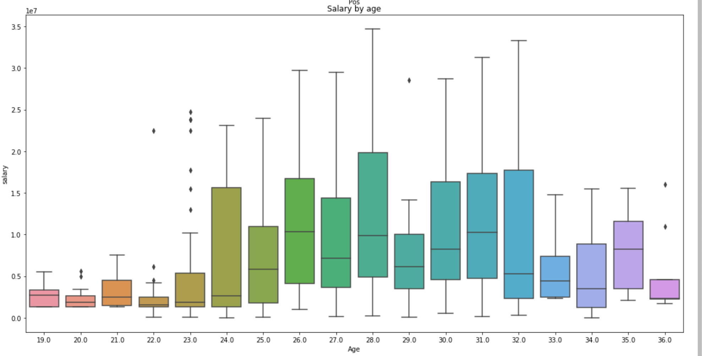

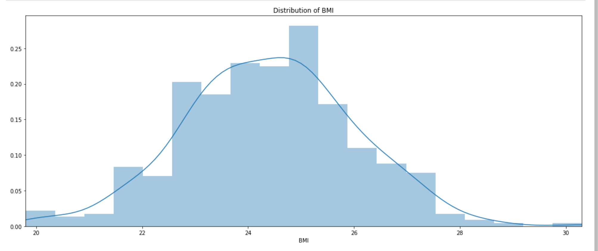

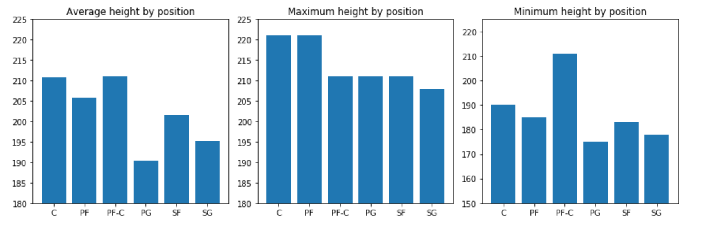

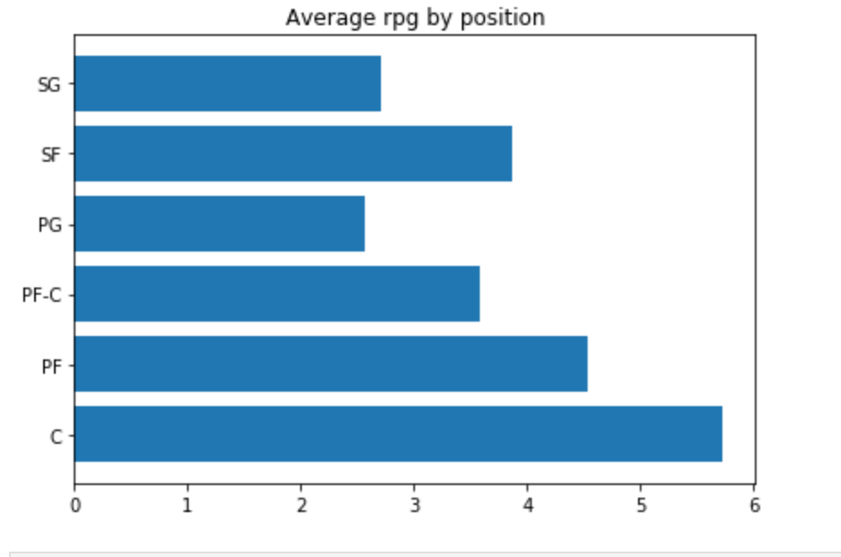

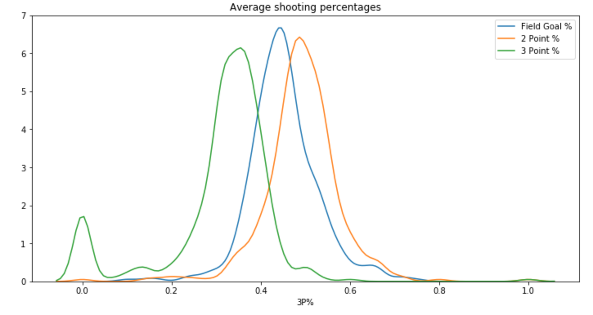

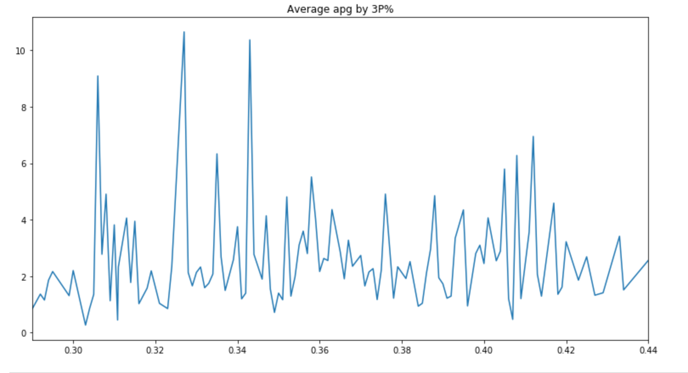

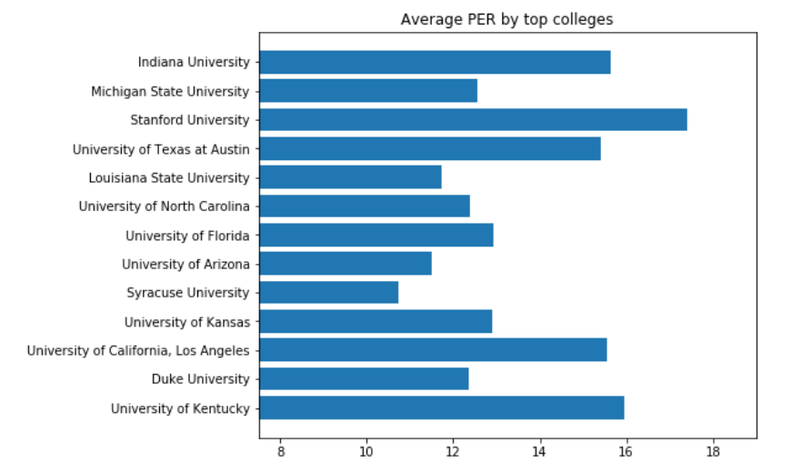

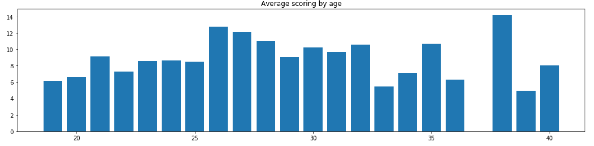

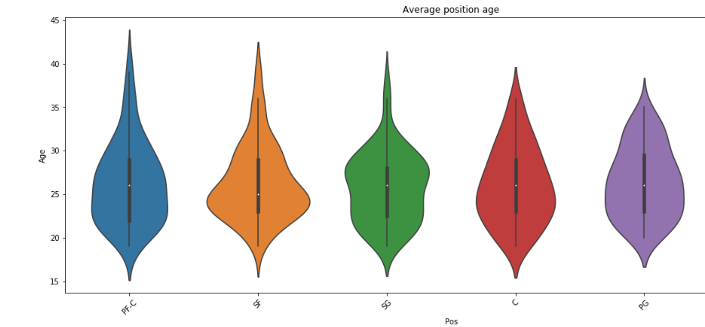